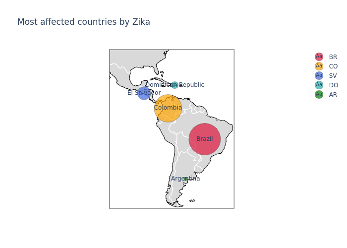
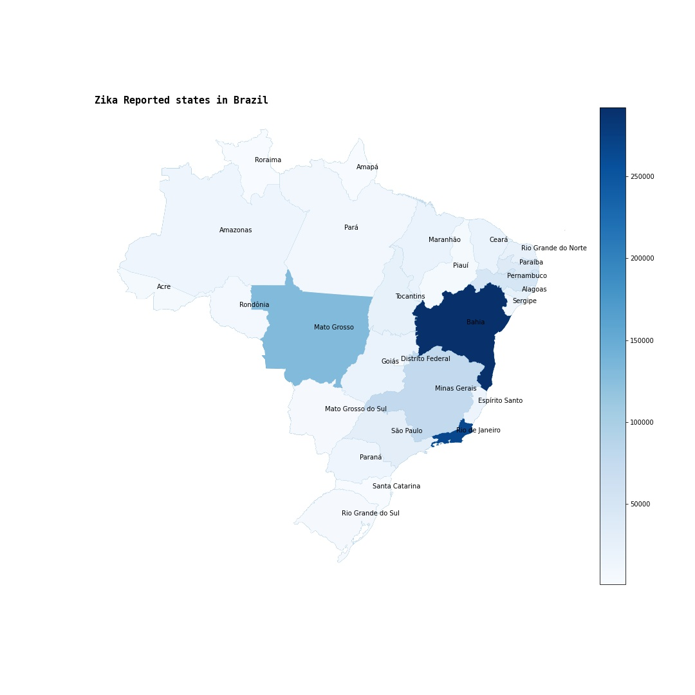
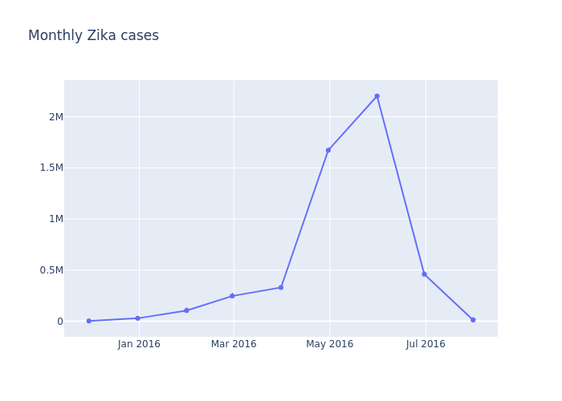

# Zika Data Analysis

This project is carried out in order to determine which location had the most cases of Zika, according to the [Zika-cdc](https://drive.google.com/file/d/1QUMvzjOmnlXel_QkhaOInIQyTGuOw7vR/view?usp=sharing) Dataset. Using different tools to explore, clean and transform the data obtaining the necessary information.

Libraries used:
  - Pandas
  - Matplotlib
  - Numpy
  - Geopandas
  - Plotly

### Zika Cases by Country

This images was generated by merging zika dataset with countries coordinates dataset.
 
### Zika by states in Brazil

This images was generated by merging zika dataset with states in Brazil coordinates dataset.

### Monthly Cases

Time series month resampled.
